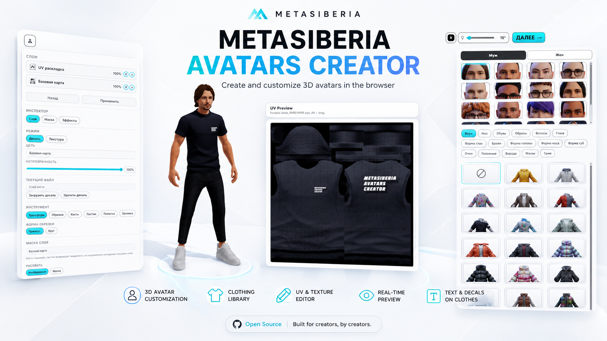

# METASIBERIA AVATARS CREATOR

**Web-based 3D avatar creator and appearance editor for the Metasiberia ecosystem.**

## About

**Metasiberia Avatars Creator** is a browser-based editor for creating and customizing 3D avatars for the **Metasiberia** virtual environment.

The editor combines character appearance customization, clothing selection, and a built-in texture/UV editing environment in a single web interface.

Users can customize their avatar visually and work directly with the textures applied to its 3D model.

### Live Editor

[**https://avatars.metasiberia.com/**](https://avatars.metasiberia.com/)

  

## Features

### 3D Avatar Editor

Interactive avatar customization directly in the browser:

* male and female avatar presets;
* face selection;
* hairstyles;
* eyes and facial features;
* head and face shape;
* clothing and footwear;
* eyebrows;
* glasses and accessories;
* masks and makeup;
* real-time 3D preview;
* lighting control;
* avatar rotation and inspection.

### Built-in UV & Texture Editor

The editor includes an integrated texture and UV workflow:

* UV preview;
* base texture editing;
* layer-based workflow;
* decals and custom graphics;
* masks;
* brush tools;
* text on clothing;
* opacity and blending controls;
* real-time texture preview on the avatar.

### Clothing & Appearance

The editor contains a visual library of avatar elements, clothing, hairstyles, facial features, and accessories, allowing fast appearance customization directly in the browser.

## Metasiberia Ecosystem

**Metasiberia Avatars Creator** is part of the **Metasiberia** ecosystem — a set of interconnected tools for creating virtual environments, avatars, landscapes, and digital content.

### Metasiberia

Main virtual environment and core project.

**Website:**
https://metasiberia.com/

**GitHub:**
https://github.com/shipilovden/sub-metasiberia

### Metasiberia Avatars Creator

Browser-based 3D avatar customization and texture editor.

**Editor:**
https://avatars.metasiberia.com/

**GitHub:**
https://github.com/shipilovden/avatars.metasiberia

### Metasiberia Terrain Generator

Browser-based terrain and landscape creation tool for the Metasiberia ecosystem.

**Editor:**
https://terragen.metasiberia.com/

**GitHub:**
https://github.com/shipilovden/terragen.metasiberia

## Author

**Denis Shipilov**

Creator and developer of **Metasiberia**, **Metasiberia Avatars Creator**, and **Metasiberia Terrain Generator**.

**GitHub:**
https://github.com/shipilovden

**Telegram:**
https://t.me/denshipilov_metasiberia

**Twitter (X):**
https://twitter.com/denshipilovart

**Metasiberia:**
https://metasiberia.com/

---

  <strong>METASIBERIA</strong> 
  Create identity. Create space. Create your virtual world.

